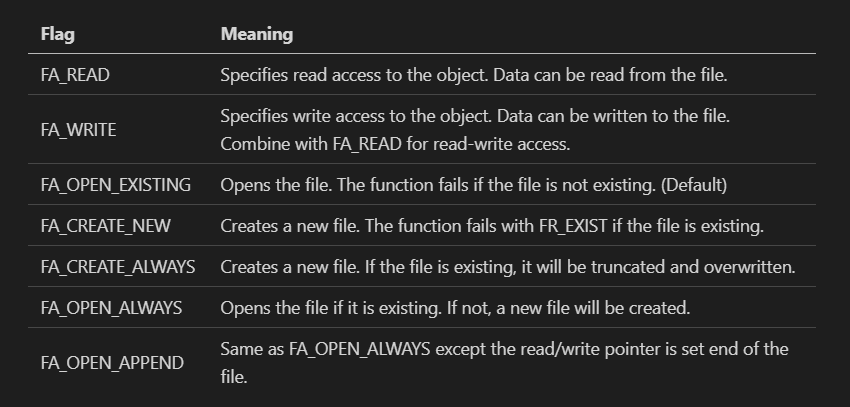
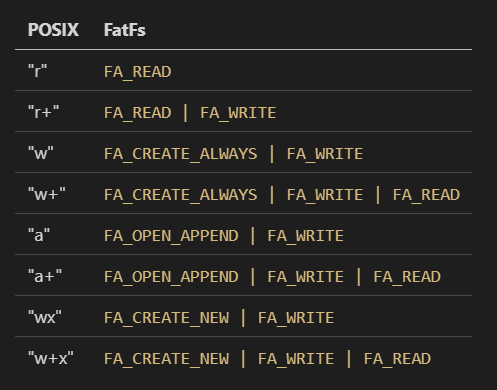
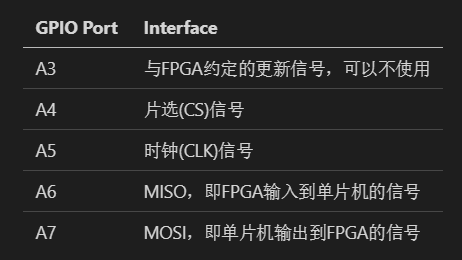

# SD卡 & SPI接收 by MINADUKI @ NJUEE
## SD卡部分
SD卡驱动适用于STM32F407核心板包含了从正点原子探索者开发板移植而来的FatFs文件系统，可以在电脑上以FAT32格式读出。  
使用SD卡驱动，需要保证以下文件存在：   
`HARDWARE/SDIO/*`   SD卡核心驱动  
`HARDWARE/W25QXX/*` 板载FLASH驱动（本核心板上不可用）  
`MALLOC/*`  内存分配函数  
`ff13c/*`   FatFs核心函数  
`FWLIB/src/stm32f4xx_dma.c` STM32的DMA总线驱动  
`FWLIB/src/stm32f4xx_sdio.c`    STM32的SDIO驱动  
### 初始化函数
使用`my_mem_init(SRAMIN)`函数来初始化内存分配功能。  
使用`SD_Init()`函数来初始化SD卡，SD卡初始化成功后，可以在变量`SDCardInfo`中查看SD卡信息。  
使用`exfuns_init()`函数初始化文件系统。 
### 分配内存
用户可以使用诸如`mymalloc(SRAMIN,%YOUR_SIZE%)`的语句分配一段内存空间，函数的返回值为空间对应的指针。 
### 直接读写存储卡扇区
使用`SD_ReadDisk(%PTR_OF_BUFFER%,%NO_OF_SECTOR%,%NUM_OF_SECTORS%)`函数来读取第`%NO_OF_SECTOR%`为首的`%NUM_OF_SECTORS%`个扇区，并将结果保存到`%PTR_OF_BUFFER%`指向的内存空间。  
使用`SD_WriteDisk(%PTR_OF_BUFFER%,%NO_OF_SECTOR%,%NUM_OF_SECTORS%)`函数来将`%PTR_OF_BUFFER%`指向的内存空间的内容写入第`%NO_OF_SECTOR%`为首的`%NUM_OF_SECTORS%`个扇区内。
### 挂载存储卡至文件系统
使用函数`f_mount(fs[0],"0:",1)`来挂载存储卡，存储卡的根目录为`0:`。
```
函数的返回值为0则初始化成功，否则请在ff13c/source/ff.h的第180行查看错误代码对应的错误类型。
```
### 文件操作
**定义一个FIL类型的指针fp并分配对应的空间，作为打开的文件的文件指针。**    
使用`f_open(fp,%FILE_NAME%,%MODE_FLAG%)`函数来打开一个文件。   
下面是不同flag对应的打开方式。    
  
如果您更习惯于POSIX格式的模式描述符，您也可以参考下表。  
  
使用`f_close(fp)`关闭文件。  
使用`f_lseek(fp,%BIAS%)`移动当前文件内的操作位置。  
使用`f_read(fp,%CONTENT_BUFFER%,%BYTES_TO_READ%,%PTR_OF_BYTES_READ%)`函数读取fp文件内的`%BYTES_TO_READ%`大小的内容，并保存在`%CONTENT_BUFFER%`内，读取到的字节数存储在`%PTR_OF_BYTES_READ%`指向的UINT格式的变量中。  
使用`f_write(fp,%CONTENT_BUFFER%,%BYTES_TO_WRITE%,%PTR_OF_BYTES_WRITTEN%)`函数读取`%CONTENT_BUFFER%`内的`%BYTES_TO_WRITE%`大小的内容写入fp文件，写入的字节数存储在`%PTR_OF_BYTES_WRITTEN%`指向的UINT格式的变量中。  
### 更多帮助
请参考`ff13c/documents/doc`目录下的帮助文件。  
本实验使用了计时器触发的内部中断驱动DAC输出声音文件，如果不需要，您可以直接删除语句`TIM3_Int_Init(5250-1,8400-1);`即可，但是请注意，由于DAC占用了GPIO输出口A4，因此本程序中SPI的片选接口为A2。我们更建议您使用下一个例程中的代码。

## SPI接收部分
SPI部分使用了STM32自带的SPI驱动，使用输入**GPIO_A_0**的**上升沿**触发外部中断调用。最高时钟速度理论可以达到30MHz，本实验中使用分频器后时钟速度在3MHz左右。  
使用SPI驱动，需要保证以下文件存在：   
`HARDWARE/SPI/*`   SPI驱动  
`HARDWARE/EXTI/*` 外部触发驱动  
`FWLIB/src/stm32f4xx_spi.c` STM32的SPI核心驱动  
`FWLIB/src/stm32f4xx_exti.c`    STM32的外部触发核心驱动  
### 初始化函数
使用`SPI1_Init()`函数初始化SPI，SPI工作在主机状态下。  
您可以使用`SPI_SetSpeed()`函数设置SPI时钟速度。    
其中，SPI的接口按如下方式绑定:   
  
使用`EXTIX_Init()`函数初始化外部中断处理，当中断触发后将执行`EXTI0_IRQHandler()`函数。
### SPI接收函数
*main函数内主要是示波器的作图触摸部分，仅使用SPI的话可以无视。具体的接收部分在`HARDWARE/EXTI/exti.c`的第30行开始，以下是关键部分的代码。*  
```
GPIO_ResetBits(GPIOA,GPIO_Pin_4);   //拉低片选信号
Data_R=SPI1_ReadWriteByte(%16bit待发送数据，不发送的话随便填%);
Data_Process();                     //处理数据(如果需要)
GPIO_SetBits(GPIOA,GPIO_Pin_4);     //拉高片选信号
```
以上为接收一次的代码，一次接收16bit的数据，您也可以在`SPI1_Init()`函数中修改一次接收数据为8bit
接收完毕后，使用`EXTI_ClearITPendingBit(EXTI_Line0);`清除中断，等待下一次触发。